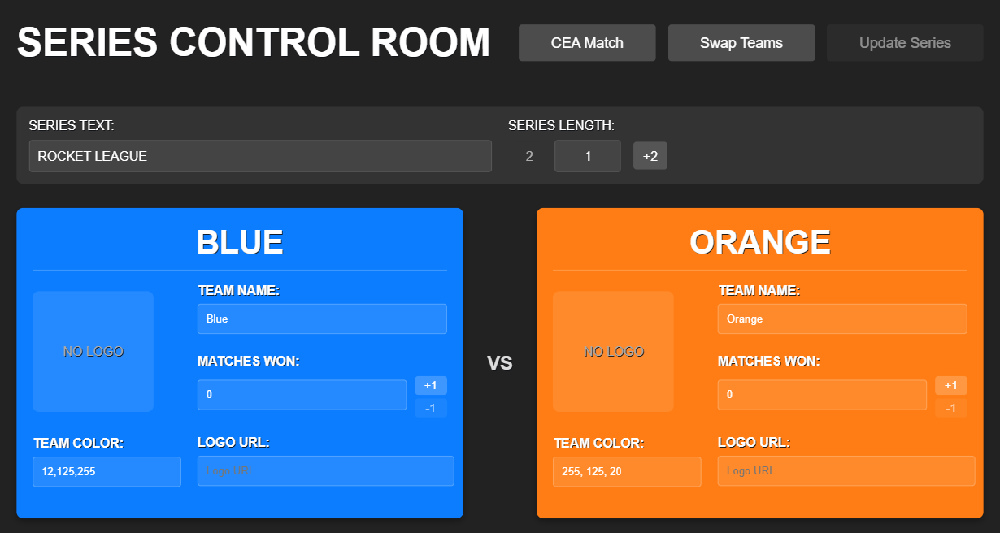

# RL_Overlay
 Broadcasting overlay to use for streaming rocket league games.

## Pre-requisites
- [BakkesMod](https://bakkesmod.com/)
- [OBS](https://obsproject.com/download)
download from link and install then configure to stream rocket league

Note: The following pre-reqs are installed via the `install.ps1` script
- [Node.js](https://nodejs.org/en/) 
- SOS Bakkes Plugin - sends game data out on websocket
- [SOS-WS-Relay](https://github.com/tynidev/RL_Overlay/blob/main/sos-ws-relay/README.md) - recieves and relays game data

## Architecture
OBS must be run on the same machine as Rocket League in order to capture the game but everything else (WS-Relay, Overlay Web Server, Overlay App) can be run on separate machines if preferred.

*NOTE: Overlay App is hosted by the Overlay Web Server which isn't shown in this diagram*

## Components
The RL_Overlay system consists of several components:

### Core Components
- **SOS Plugin (BakkesMod)**: Captures game data from Rocket League
- **SOS-WS-Relay**: Receives and relays game data via WebSockets
- **Overlay App**: The frontend overlay that displays in OBS
- **Control Room**: A separate application for managing series, teams, and overlay settings

### Additional Components
- **PlayCEA-API**: Client for the PlayCEA tournament API
- **Console Apps**: Utility scripts for recording, replaying and managing series data

## How to Install\Build

Make sure BakkesMod is installed then in powershell window run:
1. `cd <project root>`
2. `.\install.ps1` - will also create shortcuts for next steps

## How to Setup and run Test

### Option 1: Automated Setup (Recommended)
1. Double click shortcut `start-stream.ps1` or run it from a PowerShell window
   - This script will automatically:
     - Ensure BakkesMod is running
     - Configure Rocket League display settings and launch the game
     - Start SOS-WS-Relay and Overlay Server in separate terminal tabs
     - Open the Control Room URL in your browser
     - Launch OBS Studio if not already running

### Option 2: Manual Setup
1. Double click shortcut `SOS-WS-Relay` and follow prompts entering default values
2. Double click shortcut `Overlay-Server`
3. In OBS add new source of type Browser to OBS Scene
4. Configure source as follows:

5. Size Source to OBS canvas
6. Double click shortcut `Test-Game`

If test is successful then in the future you only need to start RocketLeague and run steps 1 and 2 to setup your stream.

## Manual Instructions (Case you like to do it yourself)
### 1. Build Overlay Server (only need once OR on any changes)
In terminal:
1. `cd <project root>\overlay-app`
2. `npm install`
3. `npm run build`
4. `npm install -g serve` (only need step 4 once to install serve command for later)

### 2. Install SOS plugin & Run Rocket League
Steps 1-3 only needed once.
1. Copy `<project root>\bakkes-plugins\SOS.dll` to `%appdata%\bakkesmod\bakkesmod\plugins`
2. Copy `<project root>\bakkes-plugins\sos.set` to `%appdata%\bakkesmod\bakkesmod\plugins\settings`
3. Add new line `plugin load sos` to BakkesMod plugin load cfg at `%appdata%\bakkesmod\bakkesmod\cfg\plugins.cfg`

In the future just open Rocket League.

4. Run Rocket League

Video showing how to get SOS running 
https://www.youtube.com/watch?v=QE816DBuwI4

### 3. Build & Run ws-relay
[Original Documentation](https://github.com/tynidev/RL_Overlay/blob/main/sos-ws-relay/README.md)

To build run Step 1-2 in terminal.
1. `cd <project root>\sos-ws-relay`
2. `npm install`

To run ws-relay complete step 3 in terminal.

3. `node ws-relay.js`

### 4. Build PlayCEA-API
In terminal:
1. `cd <project root>\playcea-api`
2. `npm install`
3. `npm run build`

This will build the Node.js client for the PlayCEA tournament API.

### 5. Build Control Room (optional)
The Control Room is a separate application that provides a UI for managing series, teams, and overlay settings.

In terminal:
1. Open the solution in Visual Studio: `<project root>\control-room\ControlRoom.sln`
2. Build the solution in Visual Studio
3. Run the ControlRoom project

### 6. Run Overlay Server
In terminal:
1. `cd <project root>\overlay-app`
2. For production run: `serve -s build` OR for testing/developing run: `npm start`

## Using the Control Room
The Control Room interface is accessible at `http://localhost:3000/ctrl` once the Overlay Server is running. This provides a UI for:

- Managing team information and logos
- Controlling series settings (best-of-3, best-of-5, etc.)
- Adjusting overlay appearance
- Monitoring game state

## Using Console Utilities
The project includes several console utilities in the `console-apps` folder:

- **record.js**: Record game data for later playback
- **replay.js**: Replay previously recorded game data
- **series.js**: Manage series configuration

To run these utilities:
1. `cd <project root>\console-apps`
2. `node <script-name>.js`

## Extras
### ButtonMash.dll
The file `<project root>\bakkes-plugins\ButtonMash.dll` is a BakkesMod plugin that automatically joins matches as specator. This can be installed by providing `-ButtonMash` switch to `install.ps1` script.

### RCONN connection to Rocket League
The Overlay App can be configured to connect to Rocket League through a remote connection or RCONN plugin in BakkesMod and execute commands to automatically hide the UI elements when a match starts.

Steps to configure:
1. Get RCONN password located in file `%appdata%\bakkesmod\bakkesmod\cfg\config.cfg`. Look for line that starts with `rcon_password` and take the following value.
2. Add `.env` file at `<project root>\overlay-app` and add text `REACT_APP_RCONN_PASS = <rconn password from step 1>` to the file on its own line.
3. Add the following commands to rcon allowed list in file `%appdata%\bakkesmod\bakkesmod\data\rcon_commands.cfg`
  - `replay_gui`
  - `rcon_refresh_allowed`

### Available Shortcuts
The installation creates several shortcuts for quick access:
- `Game-Stats.lnk`: View game statistics
- `Mini-Map.lnk`: Open the mini-map view
- `Overlay-Server.lnk`: Start the overlay server
- `Overlay.lnk`: Open the main overlay
- `Series.lnk`: Manage series settings
- `SOS-WS-Relay.lnk`: Start the WebSocket relay
- `Test-Game.lnk`: Run a test game scenario
